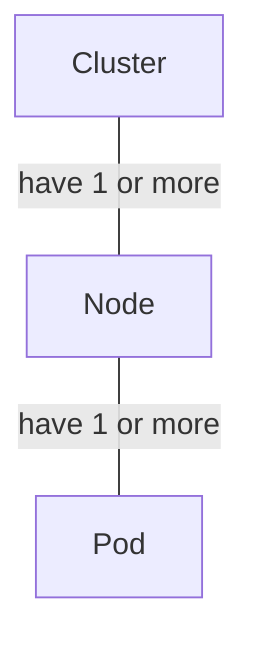
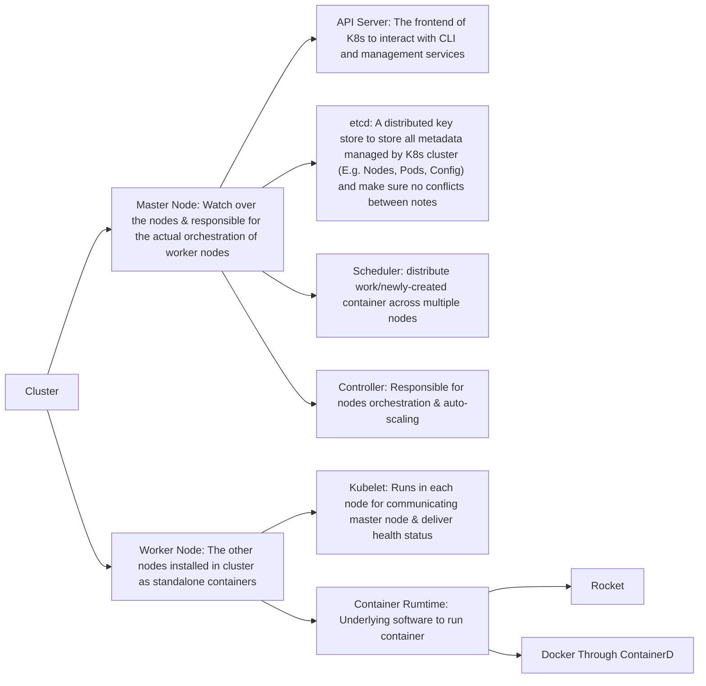

# What's Kubernetes?
---

A container orchestration technology that manages and deploys thousands of containers in a  cluster through orchestrate the **connectivity** and **auto-scaling**.
# Hierarchy of  Kubernetes
---
## The hierarchy of Kubernetes unit
---

## The architecture of Cluster
---

# K8s CLI Tools
---

* **Kubectl**
* **ctr**: Use for **ContainerD** in debugging, not user friendly with limited features
* **NerdCtl**: Use for **ContainerD** runtime in actual practice, docker-like command line tool
	* Support **Docker Compose** & Other new features like encrypted images
* **CriCtl**: Use for other container compatible with **Command Runtime Interface (CRI)** for debugging purpose (E.g. Rocket)
* **Kubeadm**: a tool built to provide `kubeadm init` and `kubeadm join` as best-practice "fast paths" for creating Kubernetes clusters.